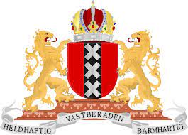

# les-6
Dit is een oefening

## dit is een kleine kop

- eerste
- tweede
- derde

* links
* rechts
* rechtdoor

1. eerste
2. tweede
3. derde

[mijn website](https://sjo.hosts1.ma-cloud.nl/wiskundePortfolio2017/)

